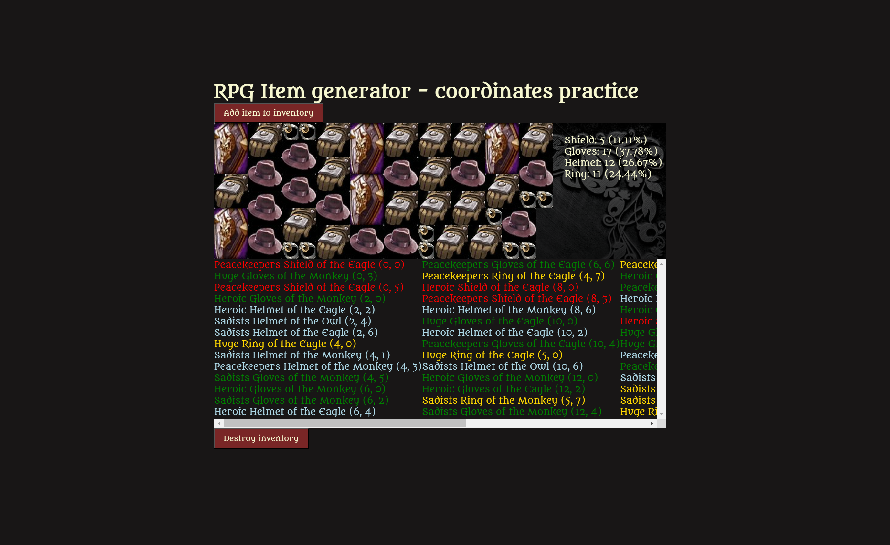

## How I did not create an Item Generator. The ADHD guide.

1. Wanted to build an item generator for reasons unknown. 
    - Prefixname plus itembase plus suffixname plus some stats easy.

2. Decided I needed an inventory to render the names.
    - Then I added item sizes. Why not, right?
    - A good way to practice some coordinates.

3. Build a small interface for it. Why not.
    - Images to overlap the grids occupied by the items.

4. Added some sounds because of course I did.

5. Made a "list of features" on how this should work:
// signaling what can fit.
// rightn ow it's bruteforcing every time.
// how would we approach loggin 2x columns.
// like split total grid 20 into two 10 columns. 
// mark columns what can they still fit.
// if a col with 2x2 remainder could signal items over 2x2 size to not check further.
// its already indexed after the first item.
// so when we find space for item, we can flag it for the next search.
// also can flag col full for specific size.
// so send back the location
// and before bruteforcing, check the itemtype size.
// great now it's becoming computer science and big O.
// found scanline algorithm as my thoughts on this.

6. Nah, just archive it.

7. At least I have an inventory.

8. The item generator was never finished.